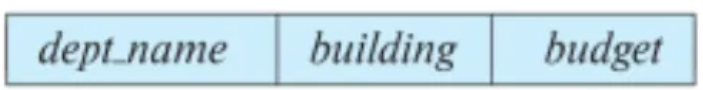

# 1주차

### 데이터란?

컴퓨터에 저장된 모든 정보

i**nformation that is stored or shared electronically**

정형 데이터 vs 비정형 데이터

정형 데이터 : 구조를 갖고 있는 데이터 (테이블 형식으로 저장할 수 있는 것)

비정형 데이터 : 구조가 없는 데이터 (텍스트, 이미지, 오디오, 비디오)

semi-structured data : 구조가 있으면서도 없는 데이터 (JSON)

데이터베이스가 무엇인가? an organized collection of datalection o

데이터모델이란 무엇인가? show how data is **stored**, **connected**, **accessed** and **updated** in the database
(⇒ 저장되어있는 데이터를 어떤식으로 연결하고 접근하고 저장하는지)

계층적 데이터 모델 : 트리

네트워크 데이터 모델 : SNS 같은 느낌

하이브리드 데이터 모델 : 계층적 + 네트워크 데이터 모델

File system → Hybrid model → Relational model → …
(Relational model을 가장 많이 사용)

### Relational Model

Relational == table

테이블형태로 데이터를 관리

관계형 데이터베이스란? stored across multiple tables
서로 연결되어있음.

### DBMS

데이터베이스 관리 시스템 (=소프트웨어)

store, retrieve, define, manage

DBMS를 사용하는 이유 : 새 데이터베이스 생성, 데이터베이스 구조 생성, 수정,

### Query = 질의

내 데이터베이스에 보내는 요청 → 데이터베이스는 요청을 받아서 응답을 보냄

### Database Schema

= metadata = logical structure of the database

Database Instance = content

schema = metadata = structure

아래 그림을 보고 스키마를 작성해라. ⇒ department(dept_name, building, budget)

### Database users

- Naive users : DBMS를 전혀 모르지만 항상 데이터베이스를 사용하는 사용자들
- Database Designers :
- Application Programmers : 개발자
- Sophisticated users : SQL Query 작성
- Database Administrators : 총괄관리자

### SQL

SQL은 프로그래밍언어가 아님

- [시험] SQL statements are divided into four major categories
    - Data Definition Language (DDL)
    - Data Manipulation Language (DML)
    - Data Control Language (DCL)
    - Transaction Control Language (TCL)

### Data definition language (DDL)

create modify

schema만 만들고 데이터는 아직 넣지 않음

ALTER, DROP, RENAME, COMMENT, TRUNCATE

### Data manipulation language (DML)

데이터를 조작함

searching, modifying, inserting, deleting

**SELECT**	name 

**FROM**	instructor 

**WHERE**	dept_name=‘Comp.Sci.’ (조건)

### Data Control language (DCL)

Control = Security + Protection

권한을 준다.

### Transaction Control language (TCL)

중간에 문제가 발생해서 복구하는 것

### Recent Tech

unstructure data → structure data 이동이 쉽지 않음

NoSQL = No relation Database