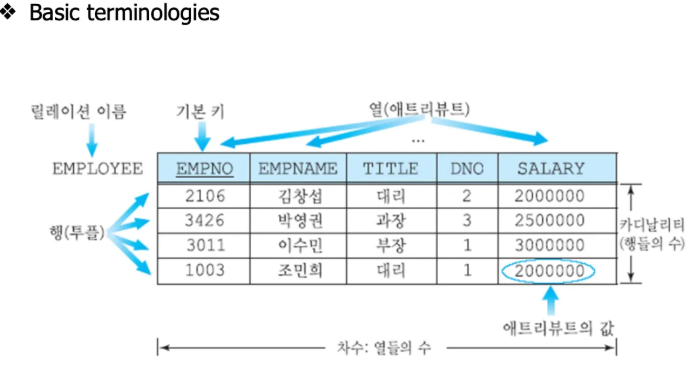
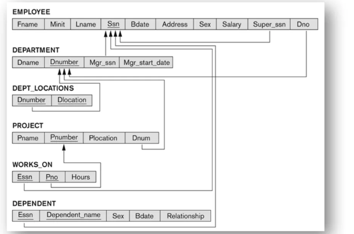
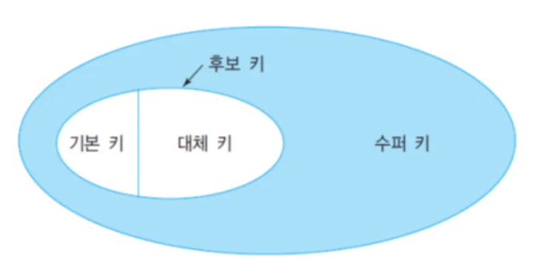
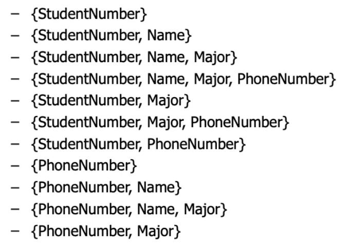
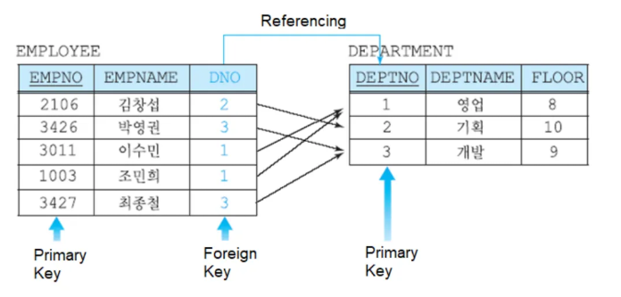
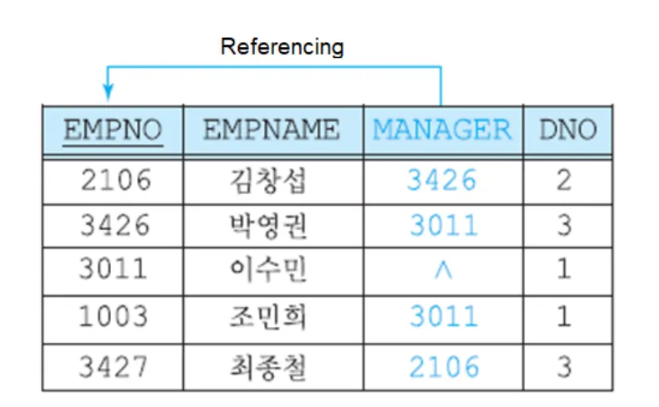
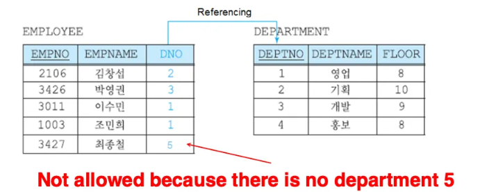

# 2주차

## Relational Model

Rows : 가로

Columns : 세로

### (시험) Basic Termminologies

- 테이블 네임 = 릴레이션 네임
- Columns = attributes = 열
- Rows = Tuples = 행 = records
- Cell = attribute value = 한 칸을 의미
- Cardinality = 행들의 개수 = 4
- 최소 행들의 개수는 0이다. (테이블은 존재하지만 데이터는 없는 상태)
- Degree = 열들의 개수 = 5
- 최소 열들의 개수는 1이다.
- 열들의 개수는 자주 바뀌지 않는다.
- Primary key = 아래 밑줄 쳐져있음
- Domain : 열의 데이터 타입
ex) EMPNAME varchar(20)
- Relation Schema : 릴레이션네임(어트리뷰트1, 어트리뷰트2, …)
ex) EMPLOYEE(EMPNO, EMPNAME, TITLE, …)
- Relational Database Schema
S : Name of DB
R : Relations

6개의 Relation 존재

Company = (EMPLOYEE, DEPARTMENT, …)

- Null value

Quiz
Table - Relation
Row - Tuples
Column - Attribute
Unknown Value - Null Value
Table Definition - Rel Nam
Table with Data - Instance
All Possible Value in a Column - Domain

## Characteristics of Relation

- Each relation in a database must have a distinct or unique name
- 행의 순서가 중요하지 않다
- 각각의 attribute는 서로 다른 이름을 갖는다
- attribute(열) 순서는 중요하지 않다
- 똑같은 튜플(행)이 존재하면 안된다
- 각각의 Cell은 나눌 수 없다 (배열이 올 수 없다)

## Keys

attribute 이다

Primary key, Foreign key 두 개를 자주 사용한다

### Super Key

An attribute or a set of attributes that uniquely defines a tuples in the relation

콤비네이션을 만들어준다 (얘네가 함께 있으면 식별이 가능하다)

스키마 : Student(StudentNumber, Name, Major, PhoneNumber) 

### Candidate Key

슈퍼 키 중에서 가장 작은 거 ({StudentNumber}, {PhoneNumber})

### Primary Key

아래 밑줄 그어져있음

### Alternate Key

밑줄 그어져 있는 거 말고 다른 유니크한 키

### ✋ Foreign Key

외래키

연결하는 수단

- 다른 relation의 primary key를 참조하고 있는 키

- 본인을 참조하고 있는 키
^ : Null

- Foreign key that is a composite of the primary keys

## Integrity Constraints (제약조건)

A set of rules used to ensure the accuracy and consistency of the relational database

### Key Constraint

1. 모든 relaiton은 기본 키를 갖고 있어야 한다
2. primary key는 반드시 유니크 해야 한다
3. primary key에는 NULL 이 들어갈 수 없다

### Domain integrity constraint

1. 데이터 타입을 먼저 선언하고 작성해야 한다
2. 배열이 들어가면 안된다
3. 하나의 열 내부에서는 같은 데이터 타입을 가지고 있어야 한다
(어떤건 숫자로 표기하고 어떤건 문자로 표기하면 안됨)

### Referential(foreign key) integrity constraint

1. 외래키에 있는 값은 참조할 때 모든 값이 존재해야 한다.

(여기에 5는 존재하지 않음)

### Pros and Cons of Relational Model

장점

- 간단하다
- 쓰기 쉽다
- Accurancy
- Data Integrity
- 정규화되어있다
- 보안

단점

- Not very good for large databases
- Difficult to find the relationship between tables
- Because of the complex structure
데이터가 많아지면 분산되기 때문에 관리하기가 어려움