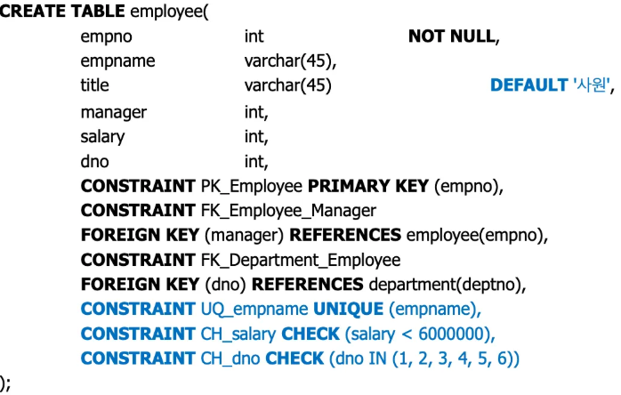
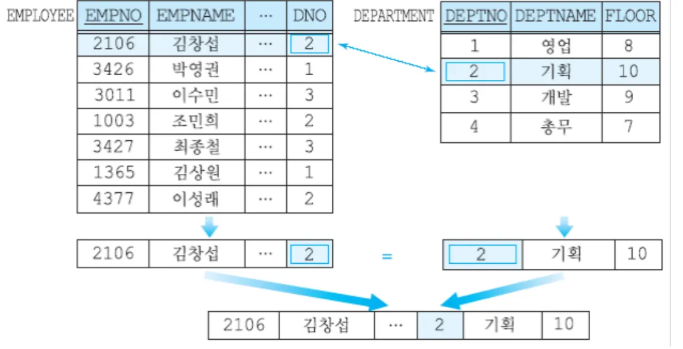
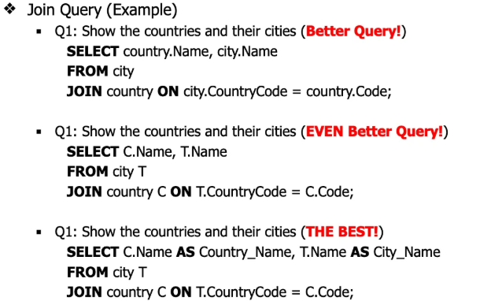
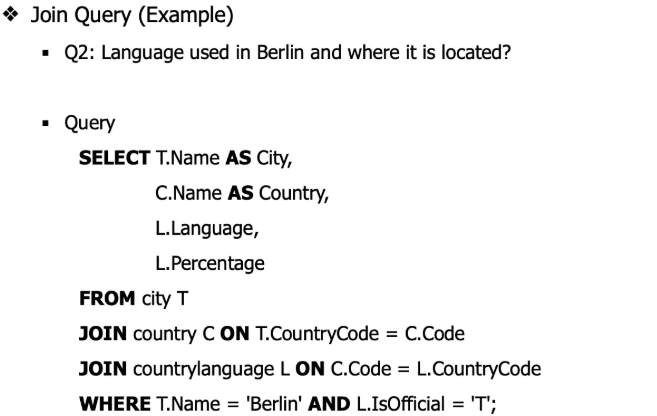
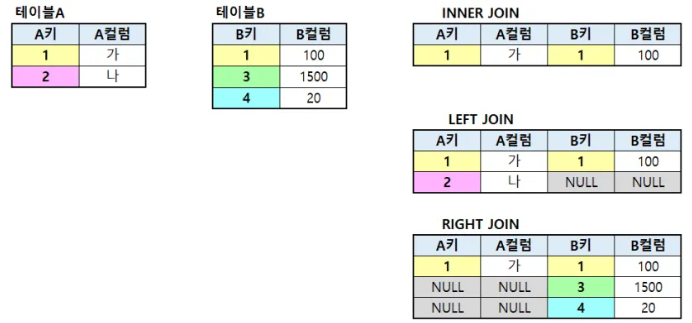

# 5주차

### 지난 주 복습

GROUP BY를 할 때 어떤 식으로 그루핑을 할 수 있는지 확인해야 한다.

예를 들면, 1, 2, 3 이런식으로 반복된 데이터가 존재하는 부분은 그루핑하기 쉽다

SELECT와 FROM은 항상 있어야함

```sql
SELECT title, count(*) AS NumberOfEmp
FROM employee
GROUP BY title
HAVING NumberOfEmp > 1; # NumberOfEmp 값이 2 이상
```

| title | NumberOfEmp |
| --- | --- |

## DDL

아래 셋은 Rule 이다

- UNIQUE
- CHECK
- DEFAULT

### ✋UNIQUE - attribute

attribute에 대한 규칙

UNIQUE와 PRIMARY KEY의 차이점 : PRIMARY KEY는 오직 하나다. UNIQUE 는 1개 이상 있다

| userid | username | email |
| --- | --- | --- |
| PK |  |  |

### CHECK - column

범위를 지정할 때 사용한다. 규칙에 들어간다

`CONSTRAINT _ CHECK (조건)`

### DEFAULT - attriibute

default value가 들어간다



## DML

여러 테이블에 데이터가 분산되어 있기 때문에 이를 연결하기 위해 JOIN 을 사용한다

related columns = common attribute = FK

### JOIN (매우 중요)

common attribute와 join condition 두 개가 중요하다

```sql
SELECT table1.column1, table2.column2
FROM table1
JOIN table2 ON
	table1.common_column = table2.common_column; # join condition 
```


- 테이블 두 개 합치기


- 테이블 세 개 합치기

- INNER JOIN == JOIN
- LEFT JOIN : 왼쪽에 있는거 전부 가져온다
- RIGHT JOIN : 오른쪽에 있는거 전부 가져온다
- CROSS JOIN : 전부 가져온다 (이건 사용하지 마라 테이블이 엄청 커짐)



```sql
# 이것도 JOIN 이다.
Select *
FROM employee, department
WHERE e.dno = d.departmentnumber
``` 