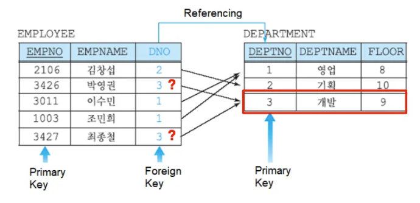
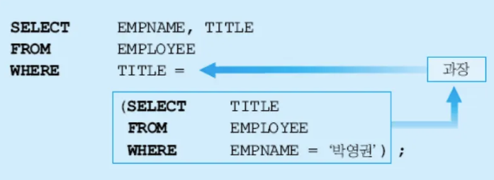
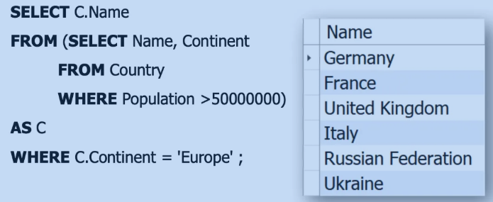

# 6주차 - Advanced Queries

### 복습

JOIN T1 ON T2; 이거랑 T1, T2 랑 같다

GROUP BY 부분 다시 복습

## Advanced DDL

- UPDATE
- DELETE



여기서 누가 부모인가? ⇒ 자식은 부모를 참조하고 있기 때문에 DEPARTMENT 테이블이 부모이다.

만약 부모 테이블의 3번을 삭제한다면 자식 테이블에서 DNO 3번은 어떻게 되는가? ⇒ 

CASCADE, NO ACTION, RESTRICT, SET NULL, SET DEFAULT ← actions (부모 relation에 추가한다) / 이 중에 하나를 추가해주면 된다

Foreign key constraint에 추가한다(?)

### CASCADE (시험에나옴)

부모 테이블에서 삭제되면 자식 테이블에서 해당하는 행도 삭제가 된다.

마찬가지로 UPDATE 할 때도 부모 테이블에서 업데이트되면 자식 테이블에서 업데이트 된다.

```sql
REFERENCES department(deptno) ON DELETE CASCADE
```

### SET NULL

부모 테이블에서 삭제되면 자식 테이블에서는 NULL 값이 된다

```sql
ON DELETE SET NULL
ON UPDATE SET NULL
```

### ✋RESTRICT, NO ACTION

?

### SET DEFAULT

기본 값으로 적용하는 것

MySQL에서 이 옵션이 없어졌다.

## Advanced DML

- Nested queries == subquery

WHERE, HAVING 가장 많이 사용한다

FROM

장점 :
- Nested Queries 는 초보자들에게 유용하고 쓰기 쉽다. (가독성 좋다)
- step by step 필터링을 가능하게 한다.
- Useful for Complex Scenarios 

단점 :
- 느리다. (JOIN 보다 느림)
- 구조를 갖고 있어서 고도화 하기 어렵다.
- 두 테이블을 연결할 때 Nested Query 대신 JOIN 을 사용한다.

그렇다면 왜 굳이 JOIN 대신 Nested Query를 사용할까?
⇒ 가독성이 좋기 때문

Nested query = Inner query

Nested Query를 먼저 쓰고 그 다음에 평소대로 Query를 작성하는 방식으로 접근하면 쉽다

Nested Query의 결과는 Single vlaue, 하나의 테이블이 될 수 있음, 여러 개의 attribute가 될 수 있음

WHERE를 통해 연결

() 안에 작성한다


먼저 Nested Query를 통해 검색하고 싶은 것을 찾고, 그 이후에 찾은 걸 기반으로 다시 찾는 느낌이다. 필터링

(시험)WHERE에 IN, ANY, ALL 중 하나의 키워드를 사용한다

(시험)JOIN을 통해서도 똑같이 만들 수 있다. (JOIN ↔ Nested)

```sql
SELECT C.Name
FROM Country C
JOIN city T ON C.countrycode = T.code
WHERE T.population > 5000000 AND C.Continent = 'Asia';

SELECT C.Name
FROM Country C
WHERE C.Code IN (SELECT T.CountryCode
								 FROM City T
								 WHERE T.Population > 5000000); 
```

EXISTS 키워드를 사용해서 존재하는지 아닌지를 판단하도록 할 수 있다.

아래 코드에서 <subquery> 는 derived table(가상 테이블)이다
바깥 테이블이 존재할때만 있고 그 이후에는 사라진다.

AS 를 반드시 써주어야 한다. 왜냐하면 가상으로 테이블이 생성되기 때문에 이 가상의 테이블을 부를 이름을 설정해야 하기 때문이다.

```sql
SELECT ...
FROM ( <subquery> ) AS derived_table # AS derived_table 이 부분은 필수사항이다. 서브 쿼리의 이름
WHERE ...
```



Step 1

가상 테이블인 Table C 생성 (FROM (…) AS C)

| Name | Continent |
| --- | --- |

Step 2

C.Contient = ‘Europe’ 에 해당하는 것들 찾아서 테이블로 반환

? JOIN이랑 Nested Query 를 같이 써도 상관없나
=> 상관 없다.