# 7주차 - E-R Diagram

Entity-Relationship Diagram (DB를 설계하기 위한 디자인이다)

ER diagrams are transformable into relational tables
⇒ ER 다이어그램만 잘 이해하면 설계한 것을 바로 MySQL로 바꿀 수 있다

## Entity

Entity == instance(=rows)

entity type == table

엔티티 타입은 직사각형 안에 적는다. 이때 엔티티 타입은 테이블을 의미한다.

엔티티 타입 대신 그냥 엔티티 라고 부르기도 한다.

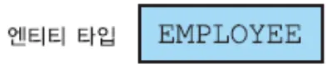

- Strong entity : PK가 있는 테이블 (하나의 직사각형 안에 그린다)
    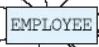
    
- Weak entity : PK가 없는 테이블 (두개의 직사각형 안에 그린다)
    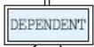
    
- Attributes(=Columns) : (id, name, email, …) (밑줄그은건뭐임?)
- Simple attribute : 하위 어트리뷰트가 없는 어트리뷰트(맞나?)
    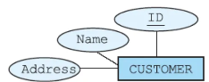
    
- Composite attribute : E-R D 얘기 할때만 존재하는 용어
ex) Full Name → First Name, Middle Name, Last Name
ex) 생년월일 → 년, 월, 일
    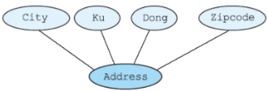
    
- Single-valued attribute : = Simple attribute
- Multi-valued attribute : 많은 값을 가진 attribute (mysql에는 없는 것)
    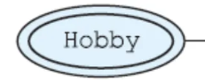
    
- Stored attribute : = simple attribute
- Derived attribute : 유도된 애트리뷰트
ex) 날짜를 알면 요일을 알 수 있다
    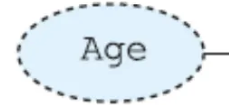

### Relationships

엔티티를 연결한다.

다이아몬드 형태로 그린다.

이름이 없어서 따로 이름을 만들어 주어야 한다. (동사 형태로)

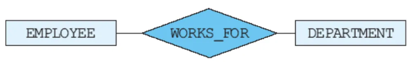

어디에 들어가기 애매한 경우에 관계를 설명하기 위해 attribute 를 쓰기도 한다.

여기서 문제가 있다.

age가 유도된 어트리븉인데, 이를 위해서는 birthday 어트리뷰트가 필요하고, university는 부사이므로 동사인 Belong 으로 바꾸는 것이 좋다. 또한, Department 는 이중 직사각형이 아니므로 key 에 해당하는 어트리뷰트가 있어야 한다.
- STNAME 부분에서 어트리뷰트 부분이 그냥 데이터를 의미하므로 틀리다.
- CFNUM 은 외래키로 사용하려고 한 것 같은데, E-R 다이어그램에는 외래키가 존재하지 않는다.

### Cardinality

1:1 = 1 to 1
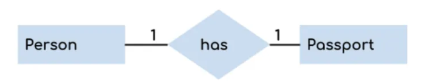

1:N = 1 to many

M:N = many to many

### Role

역할을 설명하는 것. 특별한 건 없다
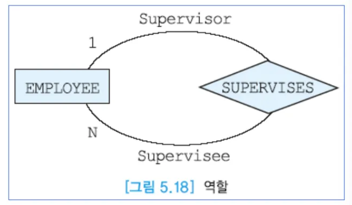

### Participation

전체 참여인지 부분 참여인지에 따라 선을 두 개 그을지 한 개 그을지 결정
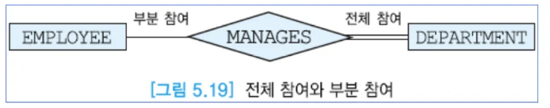

100 개의 계좌와 100 명의 손님이 있을 때, 100 개의 계좌는 모두 주인이 있어야 하지만 100 명의 손님 중 일부만 계좌를 갖고 있고 일부는 계좌가 없을 수 있다.