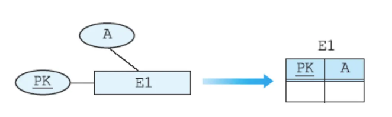
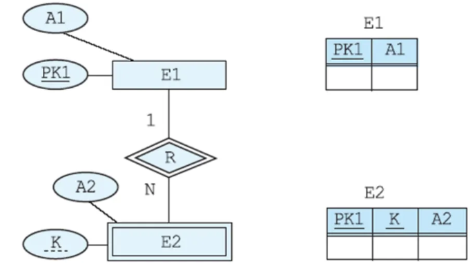
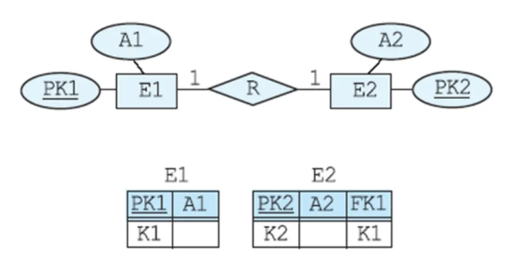
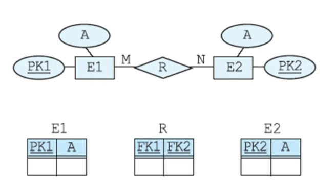
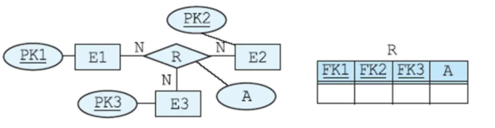
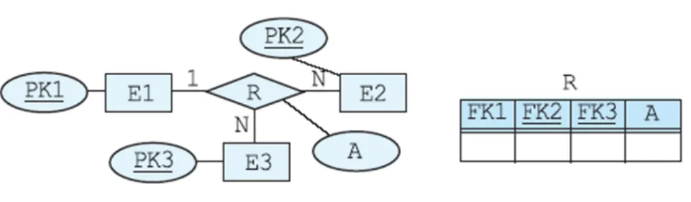
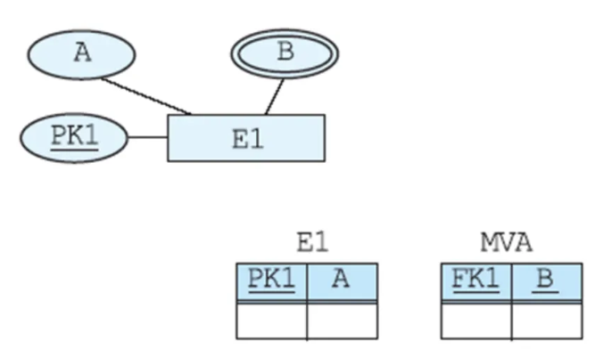

# 8주차 - E-R Diagram Mapping

스키마 = 테이블의 구조

Step 1 ~ Step 7 (순서대로 진행을 해야 한다)

### Step 1 : Regular entity types and single valued attributes ⇒ 스키마 작성

만약 복합 요소의 경우에는 해당 요소의 이름은 적지 않고 그 아래 요소들을 적는다.
예를 들어, Name 복합 요소 아래에 FirstName, LastName이 존재한다면 Name 은 데이터베이스에 추가하지 않고 FirstName, LastName 두 개를 추가해준다.
ex) Schema E1(PK, A, FirstName, LastName)
ex) PROJECT(Projno, projname, budget) ⇒ Location은 Multi value(원 두개) 이기 때문에 추가하지 않는다.

### Step 2 : Weak Entity Type and Single Value Attribute

Weak entity 는 strong entity가 없는 entity이다.

(?) Weak entity를 만들 때는 항상 부모가 있는지 확인해야 한다.

굉장히 중요함 - The primary key of the relation corresponding to the owning entity type E is included as a foreign key in the relation W

여기서 왜 E2 테이블에 PK1이 포함되는지 모르겠음

일단 E1이 Owner entity type 이라고 함

무조건 시험에 나옴) 그래서 Owner entity와 현재 entity를 둘이 합쳐서 composite entity?

### Step 3 : Binary 1:1 Relationship Type

1:1 관계인 경우 반대편의 PK를 FK로 넣어주면 된다

만약 R에 attribute가 존재하는 경우에는 FK가 들어간 쪽에 R의 attribute도 넣어주면 된다.

Among S and T, the relation that fully participates in the relationship type is selected as the relation that plays the role of S (어떤 것을 S로 선택하고 어떤 것을 T로 선택해야 하는가? ⇒ fully participates. ⇒ 연결 선이 두 개인 애를 S로 선택한다. 둘 다 선이 한 개인 경우에는 아무거나 S로 해도 된다. / 15페이지에서는 PROJECT가 S가 되고 EMPLOYEE가 T가 된다. 여기서는 Manager가 FK가 되고, MANAGES에 연결되어있는 StartDate의 이름이 MStartDate로 이름이 변경된 상태로 PROJECT의 어트리뷰트가 된다.)

### Step 4 : Regular binary 1:N relationship type

1:N 의 관계에서는 N 쪽이 S가 되고 1 쪽이 T가 된다.

따라서 S 쪽에 FK 가 추가된다 (S는 T보다 약하다로 생가각하면 됨)

18페이지에서는 EMPLOYEE가 S이고 DEPARTMENT가 T이다

따라서 EMPLOYEE 에 FK가 추가가 된다

만약 BELONGS 에 어트리뷰트가 있다면 EMPLOYEE로 간다

19페이지처럼 본인이 연결된 경우 PK이름과 비슷한 FK 를 하나 더 생성해준다. 현재 Partno가 PK이므로 스키마를 추가할 때는 Subpartno도 추가해주어야한다.

### Step 5: Binary M:N relationship type

굉장히 중요) For binary M:N relationship type R, create relation R

R 테이블을 만들어서 양쪽의 PK를 FK로 넣는다

만약 R에 어트리뷰트가 있다면 그냥 R 테이블에 추가해주면 된다

### Step 6: Ternary or higher relationship types

3차 이상의 관계에서는 N:N:N 이라면 이전과 마찬가지로 R 테이블을 생성하고 각 PK를 FK로 입력한 뒤에 연결된 어트리뷰트가 있다면 추가한다.

만약 1:N:N 이라면 1에 해당하는 PK는 FK로 가져오지면 밑줄은 긋지 않는다

### **Step 7: Multi-valued attribute**

멀티 벨류 어트리뷰트를 위해 전용 테이블을 하나 만들어준다

여기서 해당 멀티 벨류 어트리뷰트는 PK가 된다

원래 테이블의 PK는 FK가 된다

+) 유도된 어트리뷰트는 그냥 무시하면 된다.